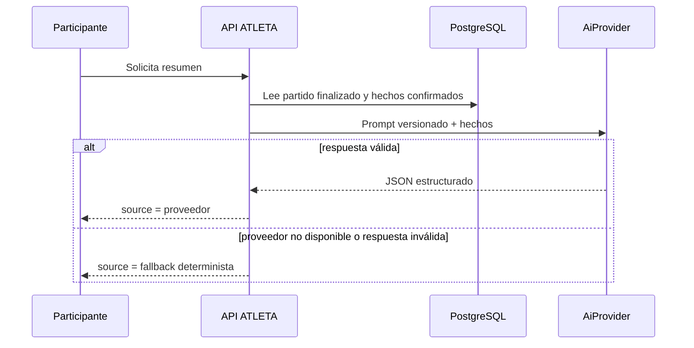

# ATLETA AI: resumen post-partido

## Qué está implementado

`POST /api/v1/matches/{matchId}/ai-summary` genera un resumen únicamente para
partidos `FINALIZADO` y solamente para participantes o su creador. No altera el
marcador, los eventos, XP, OVR ni el proceso de cierre.

La entrada se construye desde datos persistidos: marcador final, modalidad,
participantes, goles confirmados y MVP. El contrato de salida es versionado
(`match-summary-v1`) y contiene `title`, `summary`, `highlights` y `mvpComment`.

## Resiliencia y seguridad

- `AiProvider` es un límite desacoplado de proveedor; hoy el proveedor por defecto
  es `disabled`.
- Si no hay proveedor, expira o entrega JSON inválido, la API devuelve un resumen
  determinista con `source: fallback`; no falla el partido ni bloquea al usuario.
- Las instrucciones exigen usar solo hechos suministrados y la respuesta se valida
  en tamaño, forma y referencias de jugadores antes de aceptarla.
- No se ponen secretos, tokens ni datos de conexión en prompts, respuestas o logs.

## Habilitar un proveedor real

No hay proveedor externo ni credenciales de nube conectados en este repositorio.
Para incorporar Vertex AI se debe crear un adaptador que implemente `AiProvider`,
inyectarlo por configuración y mantener la prueba de fallback. Las variables de
preparación son `ATLETA_AI_ENABLED`, `ATLETA_AI_PROVIDER` y `ATLETA_AI_TIMEOUT`;
no contienen una clave ni habilitan llamadas remotas por sí solas.

## Flujo

