# Auditoría funcional y UX de Atleta

Fecha: 2026-07-21  
Alcance: frontend Ionic/Angular, API Spring Boot, navegación móvil y escritorio, contratos FE/BE y flujos principales.  
Entorno auditado: backend con perfil `test` sobre H2 efímero y frontend de desarrollo. No se modificó PostgreSQL local.

Validación técnica ejecutada:

- Frontend: `npm run build:dev` completó correctamente; sólo emitió el warning conocido de glob vacío de Stencil.
- Backend: `mvnw.cmd test` completó con `BUILD SUCCESS`: 635 tests, 0 fallos, 0 errores y 32 omitidos.

## Veredicto ejecutivo

Atleta tiene un núcleo funcional amplio y una identidad visual consistente. Autenticación, onboarding, perfil competitivo, equipos, partidos, social, estadísticas, ranking, canchas e invitaciones están modelados tanto en frontend como en backend. El mayor riesgo no es la falta de pantallas, sino la desconexión entre algunas promesas de la UI y los contratos reales: leaderboard de equipo bloqueado por autorización, SSE sin forma de enviar JWT, navegación social que abre destinos incorrectos, tipo de partido que no se persiste y creación de partido no atómica.

En experiencia, el camino feliz móvil es entendible, pero el primer valor queda frenado por tres cosas: Inicio no ofrece una acción primaria, crear equipo está escondido y crear un partido exige equipo/cancha sin ofrecer una recuperación suficientemente directa. En escritorio existe un defecto severo de layout: la aplicación se repite horizontalmente y recorta el contenido.

Prioridad recomendada:

1. Corregir OVR/leaderboard de equipo, autenticación SSE y layout de escritorio.
2. Hacer visibles `Crear equipo`, `Crear partido`, invitaciones y logout.
3. Persistir el tipo de partido y hacer transaccional/idempotente la creación.
4. Crear perfiles/equipos públicos navegables y completar edición de perfil.
5. Unificar estados/resultados, cerrar el modelo de eventos y definir RBAC para canchas.

## Mapa conceptual del producto

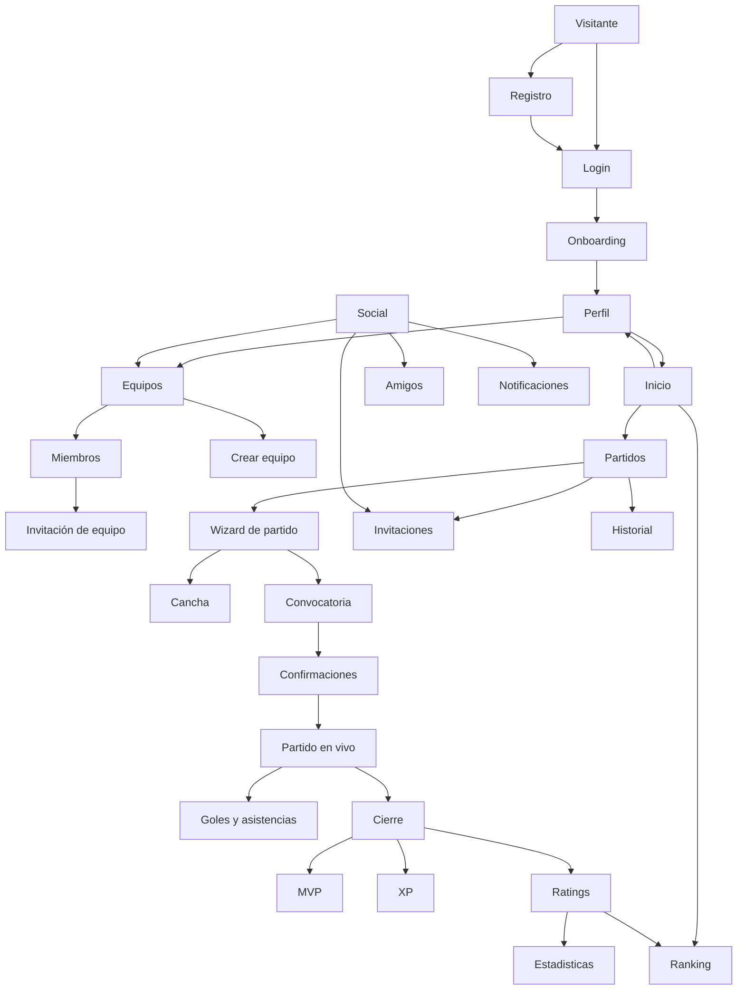

## Arquitectura funcional e integraciones

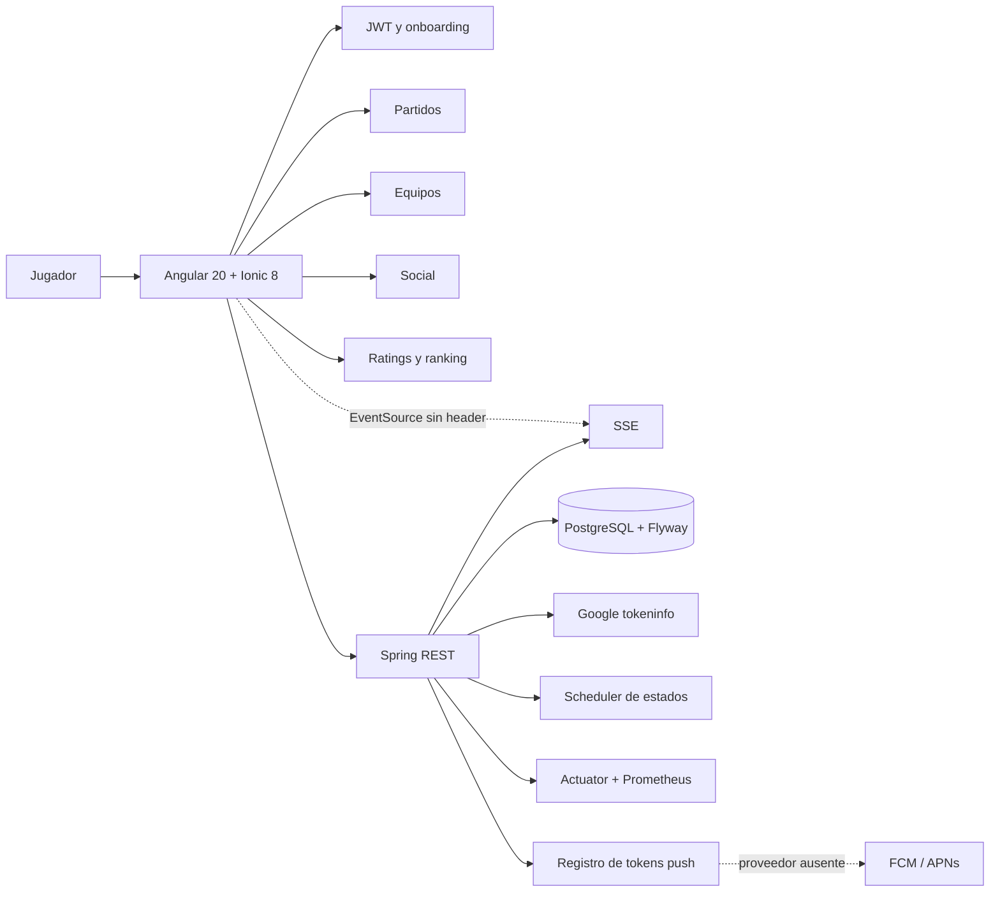

## Journey principal de un partido

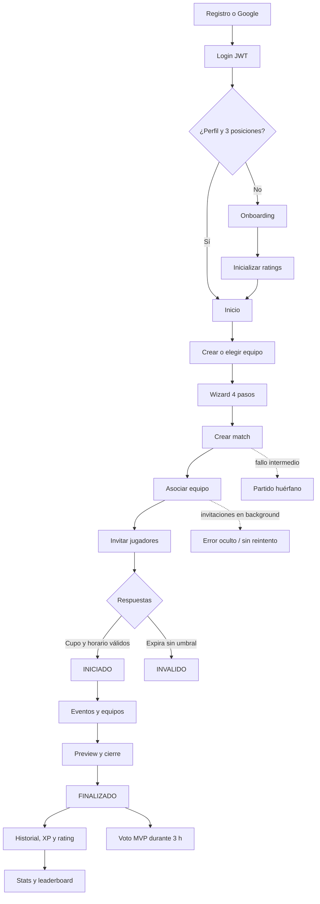

## Mapa de estados

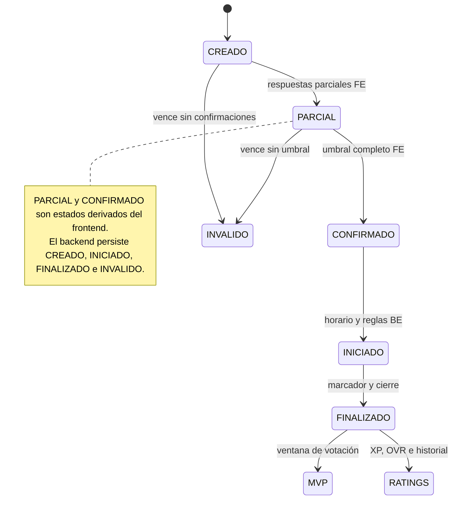

## Inventario funcional

| Área | Capacidades encontradas | Estado observado |
|---|---|---|
| Autenticación | Registro local, login JWT, Google Identity, restauración de sesión | Local funciona. Google depende de client ID. No hay reset de contraseña ni refresh/revocación completos. |
| Onboarding | Alias, género proveniente del registro, tres posiciones priorizadas, ratings iniciales | Funciona y comunica el orden 1/2/3. Presenta recorte horizontal móvil. |
| Perfil | Identidad, OVR, rol, versatilidad, resultados, posiciones, equipos, cambio de contraseña | Completo en lectura. Edición de nombre/alias/posiciones no está expuesta. Logout no existe en UI. |
| Equipos | Crear, logo, miembros, invitaciones, archivar | Crear funciona. Falta detalle público, edición, reactivación, remover miembros y roles avanzados. |
| Partidos | Hub, historial, wizard, modalidades 5v5/6v6/7v7, convocatoria, cancha, colores, confirmaciones | Flujo amplio. El tipo INTERNAL/FRIENDLY/POINTS no se persiste y la creación tiene pasos de API no atómicos. |
| Partido en vivo | Inicio, equipos, balance, goles, asistencias, SSE/polling, cierre | SSE queda bloqueado por JWT; polling oculta el problema. Confirmación dual de eventos no coincide con el cierre inmediato actual. |
| Postpartido | Preview, marcador, goleadores, XP, ratings, historial, voto MVP | Implementado. Conviene unificar vocabularios de resultados y ventanas de estado. |
| Social | Actividad, amistades, búsqueda, invitaciones de equipo/partido, notificaciones | La búsqueda funciona. “Ver perfil” y “Ver equipo” no abren el recurso solicitado. |
| Ranking y stats | OVR global, por posición, equipo, mapa por rol, historial | Stats propias cargan. Ranking de equipo falla por política de autorización del endpoint OVR. |
| Canchas | Buscar, mapa Leaflet, crear, editar por API | Alta visible desde el wizard. El mapa inicia en Buenos Aires mientras la ciudad por defecto es Concepción. Sin RBAC de catálogo. |
| Notificaciones | In-app, unread, recordatorios, token push | No existe proveedor real de envío FCM/APNs. |
| Operación | Flyway, Actuator, Prometheus, scheduler | Base sólida. Scheduler y reglas temporales aún no cubren todos los casos. |

## Evidencia del recorrido

### 1. Acceso — salud: buena con deuda funcional

- Jerarquía simple, CTA principal claro y alternativa Google visible.
- “¿Olvidaste tu contraseña?” no completa ningún flujo de recuperación.
- El texto secundario y la tipografía display son pequeños; requieren medición de contraste y prueba con zoom.

### 2. Registro — salud: buena

- Agrupación clara entre datos y seguridad.
- El registro termina volviendo a Login; falta una confirmación más explícita de “cuenta creada, inicia sesión para continuar”.

### 3. Onboarding — salud: frágil en móvil

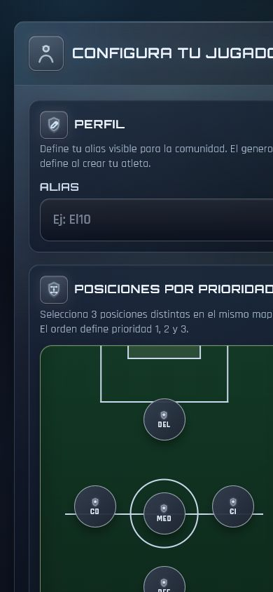

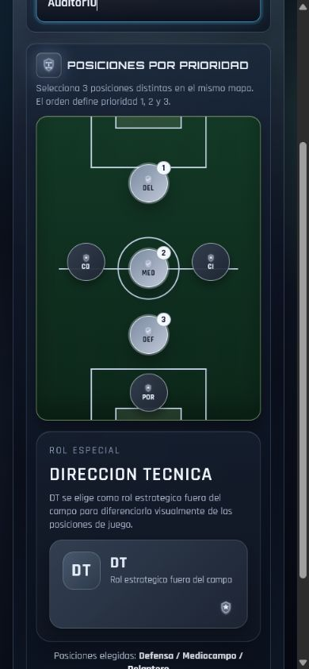

- La selección espacial y los badges 1/2/3 explican bien la prioridad.
- Títulos y contenido se recortan en 390 px; el contenedor excede el viewport.
- La pantalla mezcla posición de cancha y rol DT de forma visualmente rica, pero larga. Conviene dividir perfil/posiciones o hacer el mapa plenamente adaptable.
- Tras finalizar, el usuario aterriza en Perfil, no en Inicio ni en un siguiente paso de activación.

### 4. Perfil — salud: informativo, poco accionable

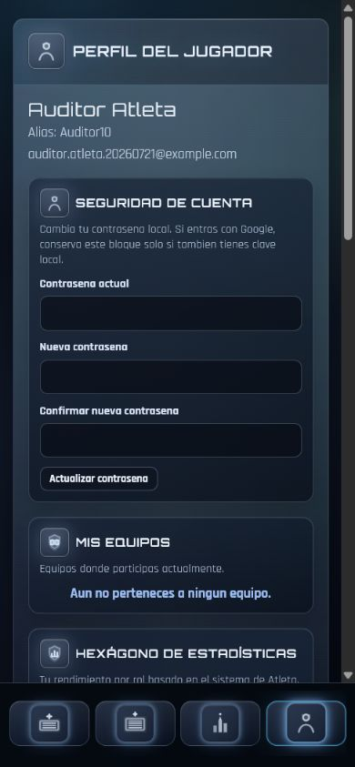

- El perfil competitivo tiene datos ricos y componentes consistentes.
- Seguridad aparece antes que la identidad deportiva y consume el primer viewport.
- No hay editar alias/posiciones, crear equipo desde el estado vacío ni cerrar sesión.

### 5. Inicio — salud: claro, sin CTA

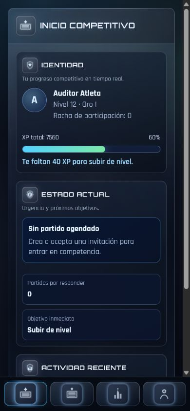

- Buen resumen de identidad, progreso, urgencia y actividad.
- “Crea o acepta una invitación” es texto, no acción. El usuario nuevo no tiene un CTA de siguiente paso.
- Un usuario con 0 partidos aparece en Nivel 12 / Oro I y 7560 XP por ratings iniciales; el modelo se percibe incoherente.

### 6. Partidos y estados vacíos — salud: media

- Tabs Próximos/Historial/Crear son fáciles de entender.
- El estado vacío pide crear, pero no incluye el botón en el mismo panel; obliga a descubrir la pestaña.

### 7. Wizard de partido — salud: buena estructura, bloqueo de dependencias

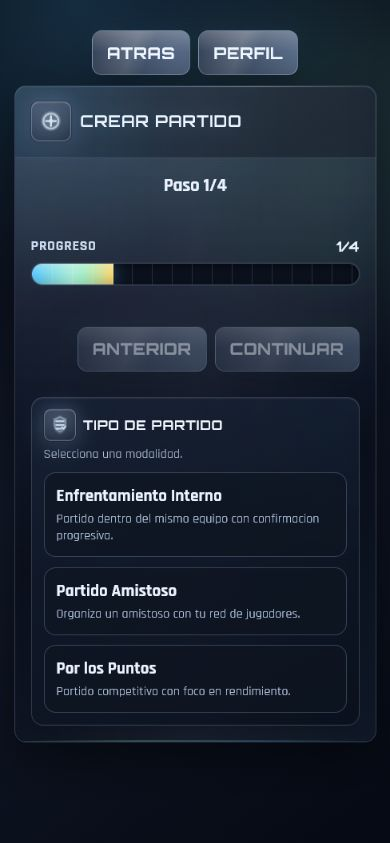

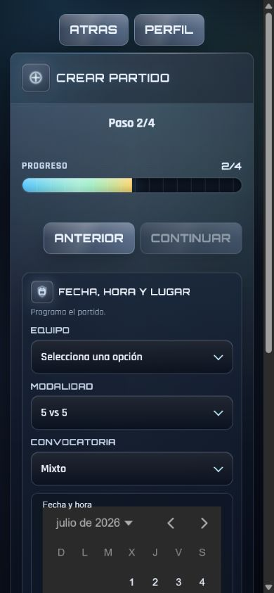

- Cuatro pasos y barra de progreso reducen incertidumbre.
- El tipo de partido parece una decisión importante, pero se pierde al recargar porque el backend no lo persiste.
- Sin equipo, el selector queda vacío y no ofrece `Crear equipo` inline.
- Fecha/hora usa un control muy pesado; su árbol accesible expone meses, años y días duplicados, riesgo de navegación extensa con lector de pantalla.
- La creación realiza match, asociación e invitaciones en llamadas separadas; un fallo intermedio puede dejar datos parciales.

### 8. Equipos — salud: funcional, entrada escondida

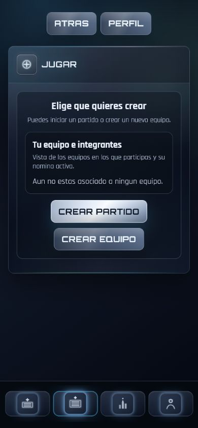

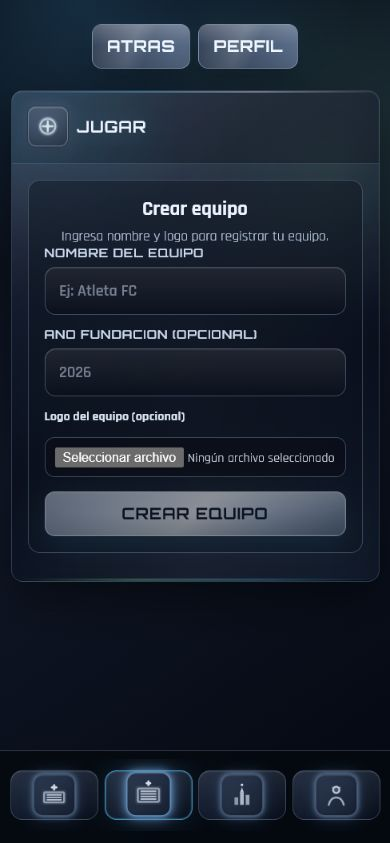

- Crear equipo con nombre funciona y asigna al creador como capitán.
- La ruta `/sessions/create` concentra “Jugar”, pero no aparece en la navegación inferior ni como acción clara en Inicio/Perfil.
- El input nativo de archivo rompe la coherencia visual y tiene texto pequeño.

### 9. Canchas — salud: media

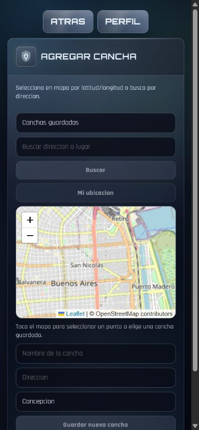

- El mapa y la búsqueda ofrecen dos modos de selección.
- El mapa abre en Buenos Aires y el formulario precarga Concepción; puede guardar ubicaciones semánticamente incorrectas.
- `Mi ubicación` aparece deshabilitado sin explicación visible.
- Cualquier usuario autenticado puede crear/editar entradas globales del catálogo.

### 10. Social — salud: búsqueda útil, navegación rota

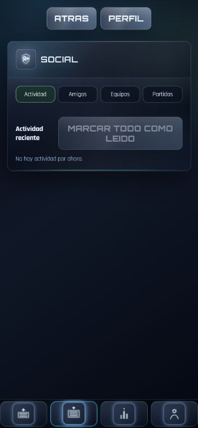

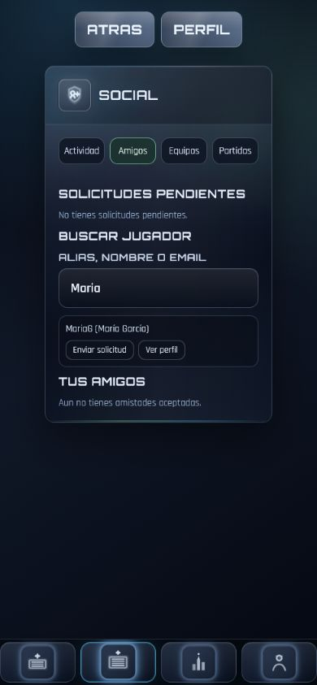

- Búsqueda por alias/nombre/email funciona y encuentra perfiles.
- En la prueba, “Ver perfil” para María García abrió el perfil del usuario auditor.
- El módulo no está en la navegación principal; su descubrimiento depende de rutas secundarias.

### 11. Estadísticas y ranking — salud: presentación sólida, datos inconsistentes

- Las estadísticas propias tienen buena jerarquía y un insight accionable.
- OVR 63 y rol 70 conviven con 0 partidos sin explicar que son valores iniciales.
- Ranking muestra estado vacío incluso con un perfil recién inicializado.
- “Mi equipo” depende de consultar OVR de terceros, pero el backend sólo permite consultar el OVR del `sub` JWT.

### 12. Escritorio — salud: crítica

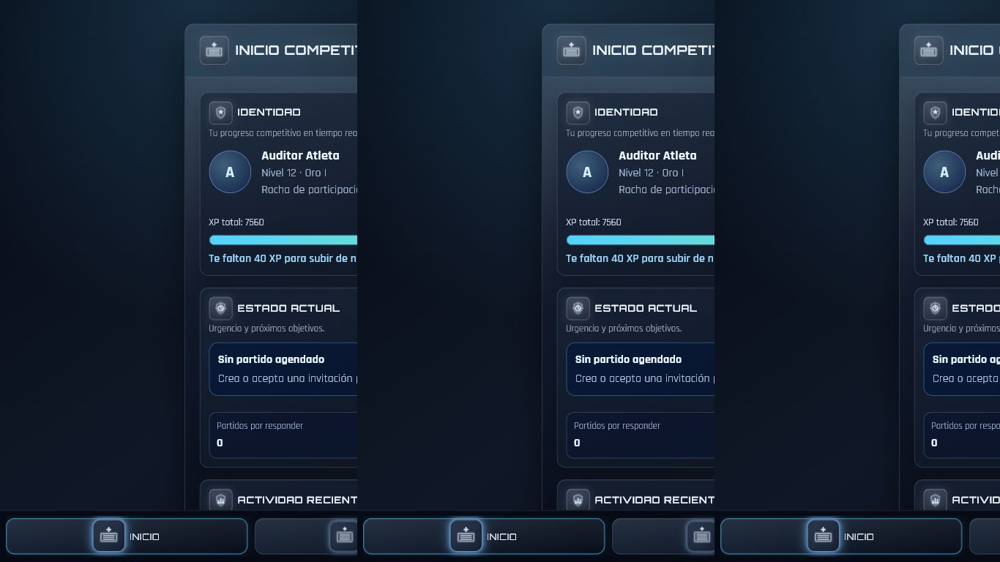

- A 1366 × 768 la interfaz aparece repetida horizontalmente en varias columnas y cada copia queda recortada.
- Debe resolverse antes de considerar soporte web/desktop. Si el producto será sólo móvil, conviene mostrar un shell único centrado con ancho máximo, no repetir el contenido.

## Hallazgos técnicos priorizados

### P0 — bloqueantes o engañosos

1. **Leaderboard de equipo y OVR ajeno bloqueados por autorización.** El frontend consulta `/ratings/player/{uuid}/overall` para miembros; el backend exige que `{uuid}` sea el usuario JWT. Solución: endpoint agregado `GET /teams/{id}/leaderboard` con autorización de membresía o un resumen OVR público explícito.
2. **SSE sin autenticación viable.** `EventSource` no envía `Authorization`; Spring protege la ruta. Usar `fetch-event-source` con bearer, cookie httpOnly o token SSE corto y firmado.
3. **Layout de escritorio repetido y recortado.** Revisar backgrounds/grid/pseudo-elementos globales y fijar un único host de contenido responsivo.
4. **No hay logout visible.** Existe `AuthService.logout()`, pero ninguna pantalla lo invoca. Añadirlo a Perfil y limpiar sesión/stores.

### P1 — alto impacto

1. “Ver perfil” y “Ver equipo” ignoran el ID y navegan a destinos genéricos. Crear `/players/:uuid` y `/teams/:id`.
2. `MatchType` vive sólo en frontend; FRIENDLY puede reaparecer como INTERNAL/POINTS tras rehidratar. Persistirlo en backend.
3. Crear partido + asociar equipo + invitar no es una operación atómica. Añadir endpoint orquestado o idempotency key y recuperación.
4. Fallos de invitaciones se silencian y quedan estados optimistas. Mostrar FAILED/RETRY y resumen servidor.
5. Reset de contraseña no implementado; refresh token existe en modelos pero no se usa.
6. Perfil no permite editar nombre, alias ni posiciones aunque el backend tiene parte de esos contratos.
7. Guard de onboarding falla abierto ante 5xx/red. Mostrar estado recuperable y bloquear operaciones dependientes.
8. Falta proveedor push remoto; hoy sólo se registra el token.
9. Alta/edición de canchas carece de moderación o RBAC.

### P2 — coherencia y escalabilidad

1. Unificar `VICTORIA/DERROTA/EMPATE`, `GANADO/PERDIDO/EMPATE` y `EMPATADO`.
2. Exponer desde backend un estado canónico; el fallback de cierre frontend usa una ventana distinta a la policy backend.
3. Elegir confirmación dual real de eventos o retirar endpoint/estado muerto.
4. Añadir wildcard/404 y rutas públicas de jugador/equipo.
5. Revisar endpoints personales que actualizan XP/trust/rating para impedir autoasignación indebida.
6. Separar servicios grandes de `matches` y versionar fórmulas de XP/rating.

## Flujo social actual y propuesta

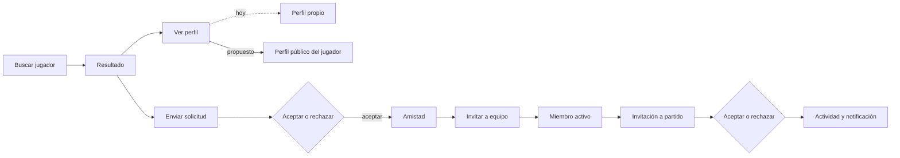

## Arquitectura de navegación propuesta

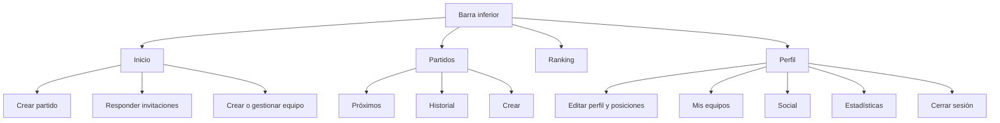

## Plan de optimización sugerido

### Iteración 1 — confianza y desbloqueo

- Arreglar responsive desktop y overflow del onboarding.
- Añadir CTA contextual en Inicio, Perfil vacío y Partidos vacío.
- Añadir logout.
- Corregir navegación de perfiles/equipos.
- Corregir OVR de equipo y SSE.

### Iteración 2 — integridad del partido

- Persistir `MatchType`.
- Crear transacción/idempotencia para match + equipo + invitaciones.
- Mostrar estado de entrega/reintento de invitaciones.
- Centralizar máquina de estados y ventanas temporales en backend.

### Iteración 3 — profundidad social y competitiva

- Perfil público y detalle de equipo.
- Edición de alias/posiciones/membresías.
- Reset/refresh/revocación de sesión.
- Push real con outbox, retries y deep links.
- Moderación/RBAC de canchas.

## Riesgos de accesibilidad y límites

- Confirmado visualmente: texto secundario pequeño, uso intenso de mayúsculas/display, estados disabled de contraste bajo y overflow horizontal en onboarding/escritorio.
- Confirmado en el árbol accesible: la barra inferior sí tiene nombres; botones de selección de posición exponen estado `pressed`; el datetime produce una cantidad muy grande de controles y duplicados.
- Pendiente de verificación: contraste WCAG medido, orden real de foco, navegación sólo teclado, focus visible, lector de pantalla, zoom 200/400 %, target size y anuncios de toast/errores.
- Las pantallas con estados vacíos no permiten validar detalle de partido, cierre, MVP y notificaciones visuales. Esos flujos se verificaron por código, contratos y pruebas existentes, no con evidencia visual completa en esta ejecución.

## Evidencia de código relevante

- Rutas: `atleta-app/src/app/app.routes.ts`
- Navegación principal: `atleta-app/src/app/shared/navigation/main-bottom-nav.ts`
- OVR de miembros: `atleta-app/src/app/features/ratings/services/leaderboard.service.ts`
- Autorización OVR: `atleta-server/src/main/java/com/atleta/demo/controller/RatingController.java`
- SSE frontend: `atleta-app/src/app/features/matches/services/match-live.service.ts`
- Seguridad backend: `atleta-server/src/main/java/com/atleta/demo/config/SecurityConfig.java`
- Navegación social: `atleta-app/src/app/features/social/pages/social.page.ts`
- Creación de partido: `atleta-app/src/app/features/matches/services/match.service.ts`
- Estado backend: `atleta-server/src/main/java/com/atleta/demo/service/MatchStatusPolicy.java`
- Guard de onboarding: `atleta-app/src/app/core/guards/onboarding.guard.ts`
