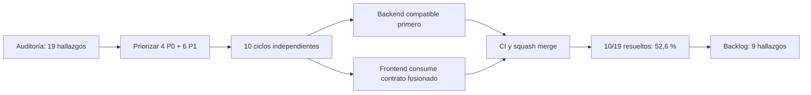
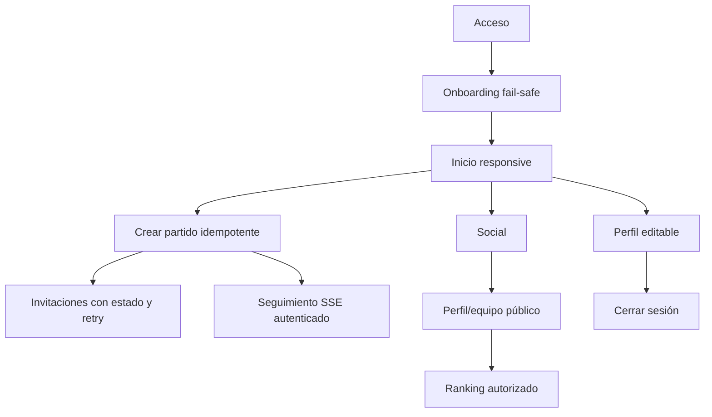

# Cierre del hito de mejoras de Atleta

Fecha: 21 de julio de 2026

Alcance: 10 de 19 hallazgos de la auditoría inicial

Resultado: **52,6 % resuelto**

## Veredicto

El hito supera el objetivo del 50 %. Se resolvieron los cuatro P0 seleccionados y seis P1 mediante diez ciclos independientes. Cada solución pasó por rama propia, pruebas locales, PR draft, CI verde y squash merge antes de iniciar la siguiente integración dependiente.

La mejora principal no es sólo visual: los flujos críticos ahora tienen contratos autorizados, persistencia consistente, reintentos explícitos y operaciones atómicas donde antes existían estados engañosos o parciales.

## Mapa del cambio

## Comparación inicial y final

| Arista | Estado inicial | Estado final | Salud final |
|---|---|---|---|
| Sesión | No había salida visible | Logout accesible limpia sesión y navega a acceso | Buena |
| Responsive | Escritorio recortado y onboarding con overflow obligatorio | Reflow de escritorio y selección móvil corregidos | Buena, pendiente captura final |
| Onboarding | El guard fallaba abierto ante red/5xx | Falla de forma segura y ofrece recuperación | Buena |
| Social | Los CTA de perfil/equipo ignoraban el identificador | Navegación a detalles públicos reales | Buena |
| Ranking de equipo | Consultaba un endpoint sólo-self para terceros | Endpoint de equipo autorizado y consumo consistente | Buena |
| Partido en vivo | `EventSource` no podía adjuntar bearer | Transporte SSE autenticado y errores visibles | Buena |
| Tipo de partido | Se perdía al recargar | `MatchType` persistido y expuesto por contrato | Buena |
| Creación de partido | Riesgo de huérfanos, duplicados y doble submit | Comando transaccional e idempotente con UI protegida | Buena |
| Invitaciones | Fallos silenciados y estado optimista falso | Resultado por destinatario y reintento selectivo sin duplicar | Buena |
| Perfil | Nombre, alias y posiciones casi sólo lectura | Edición atómica de identidad y tres posiciones priorizadas | Buena |

## Flujo resultante de confianza

## Evidencia de calidad

- Backend: suite completa con 653 tests, 0 fallos y 32 omitidos.
- Frontend: suite completa con 162 tests exitosos.
- Frontend: lint y build de producción exitosos.
- CI: verde antes de fusionar cada PR de implementación.
- Integración: los cambios full-stack publicaron primero contratos backend compatibles y luego el consumo frontend.
- Puertos compartidos al cierre: 4200, 8080 y 9876 sin listeners.

## Evidencia visual y límites

La auditoría inicial conserva 17 capturas ordenadas en `docs/auditoria-ux-2026-07-21/`. No se repitieron capturas finales ni E2E de navegador porque la condición operativa de este hito fue mantener todos los servidores de la aplicación apagados. Por esa razón:

- no se afirma una revalidación visual posterior a los cambios;
- la salud final de comportamiento se apoya en pruebas unitarias, de integración, contrato y build;
- contraste medido, teclado, foco, lector de pantalla, zoom 200/400 %, anuncios de estado y target size permanecen como verificación manual pendiente;
- una sesión visual futura debe levantar servicios de forma temporal, capturar móvil y escritorio, y apagarlos al finalizar.

## Backlog restante priorizado

1. Sesión completa: reset, refresh y revocación.
2. Proveedor push real con outbox, retries y deep links.
3. RBAC y moderación de canchas.
4. Unificación del resultado y estado canónico de partidos.
5. Definición final y versionado de eventos.
6. Ruta wildcard/404 general.
7. Revisión de autorización en XP, trust y rating.
8. Separación y versionado de servicios internos.
9. Versionado y trazabilidad de fórmulas competitivas.

## Referencias de entrega

- Auditoría y plan: [atleta#1](https://github.com/Cristianlr95/atleta/pull/1).
- Frontend: PRs [#3](https://github.com/Cristianlr95/atleta-app/pull/3) a [#12](https://github.com/Cristianlr95/atleta-app/pull/12).
- Backend: PRs [#3](https://github.com/Cristianlr95/atleta-server/pull/3) a [#9](https://github.com/Cristianlr95/atleta-server/pull/9).
