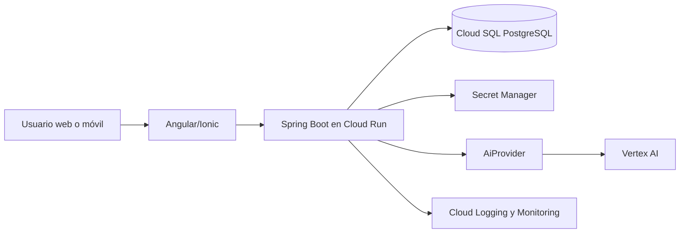

# Preparación para GCP y Vertex AI

Este documento describe una arquitectura objetivo; **no afirma que haya recursos
desplegados en GCP**. El repositorio no contiene credenciales, proyecto, IAM,
Terraform ni una integración activa con Vertex AI.

## Camino de adopción seguro

1. Crear proyectos separados para desarrollo, staging y producción, con facturación,
   presupuestos y alertas definidos por el equipo responsable.
2. Ejecutar el backend en Cloud Run con una cuenta de servicio dedicada y mínimo
   privilegio; almacenar secretos exclusivamente en Secret Manager.
3. Migrar PostgreSQL a Cloud SQL con backups, recuperación probada, conexión privada
   cuando corresponda y ejecución controlada de Flyway.
4. Implementar un adaptador `AiProvider` de Vertex AI usando identidad de la cuenta
   de servicio, límites de tiempo/costo, telemetría y redacción de PII.
5. Mantener el fallback determinista y un interruptor de configuración para desactivar
   IA sin afectar el cierre de partidos.
6. Añadir una pipeline con identidad federada (OIDC), validaciones, despliegue a
   staging y aprobación humana antes de producción.

## Decisiones pendientes de negocio

- Proyecto/región de GCP y política de residencia de datos.
- Modelo Vertex permitido, cuota, presupuesto mensual y límites por usuario.
- Retención de prompts/respuestas y consentimiento para usar datos deportivos.
- Dueño operativo de alertas, incidentes y aprobación de despliegues.
