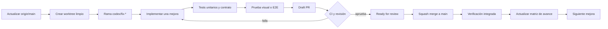

# Plan de implementación: resolver el 50 % de la auditoría de Atleta

Fecha de planificación: 2026-07-21

## Objetivo medible

La auditoría priorizó 19 hallazgos: 4 P0, 9 P1 y 6 P2. El hito se considera alcanzado cuando estén resueltos, validados e incorporados a `main` 10 hallazgos, equivalentes al 52,6 % del total.

El plan cubre los 4 P0 y 6 P1. No se contará una mejora como terminada sólo porque exista código: debe estar revisada, con CI verde, mergeada y comprobada sobre la versión integrada.

## Restricción de repositorios

Atleta está repartido en tres repositorios Git:

- `Cristianlr95/atleta-app`: frontend.
- `Cristianlr95/atleta-server`: backend.
- `Cristianlr95/atleta`: documentación y referencias Git a ambos repositorios.

Un cambio full-stack no puede publicarse en un único PR. En esos casos, un ciclo de solución tendrá un PR backend backward-compatible, seguido por un PR frontend. La referencia del repositorio padre se actualizará al cerrar el hito, una vez que las diez soluciones estén en los `main` de los repositorios hoja.

El working tree actual de `atleta-app` contiene cambios locales ajenos a este plan. Todo el trabajo se realizará en worktrees limpios creados desde `origin/main`; no se reutilizará ni limpiará el checkout actual.

## Ciclo obligatorio para cada mejora

Reglas:

1. Un hallazgo principal por ciclo.
2. La rama siempre parte del último `origin/main`.
3. No se comienza el siguiente ciclo hasta que el anterior esté mergeado y verificado.
4. Los PRs se abren como draft; se convierten a ready sólo con checks locales completos.
5. Merge recomendado: squash merge, sin commits de merge intermedios.
6. Si un PR necesita cambiar contratos, primero se publica una versión backend compatible con el frontend anterior.
7. Cada PR incluye causa raíz, cambio, impacto, pruebas y capturas cuando afecte UI.

## Secuencia de implementación

### Ciclo 0 — baseline y trazabilidad

No cuenta para el 50 %.

- Publicar la auditoría y este roadmap en `Cristianlr95/atleta`.
- Registrar los 19 hallazgos en una matriz `pendiente / en curso / mergeado / verificado`.
- Preparar worktrees independientes para frontend y backend.
- Confirmar protección de `main`, CI requerido y estrategia squash.

Resultado: punto de partida reproducible sin mezclar los cambios locales actuales.

### Ciclo 1 — logout visible

Hallazgo: P0, no existe logout utilizable.

- Repo: `atleta-app`.
- Rama: `codex/fix-visible-logout`.
- Añadir `Cerrar sesión` en Perfil.
- Limpiar tokens, sesión, stores con datos del usuario y navegación protegida.
- Verificar que volver atrás no recupere pantallas autenticadas.

Criterios de aceptación:

- El control es visible y accesible desde Perfil.
- Tras cerrar sesión, `/home`, `/matches`, `/leaderboard` y `/player/profile` redirigen a Login.
- Un segundo usuario no recibe datos cacheados del anterior.
- Tests de servicio, guard y flujo E2E de logout verdes.

### Ciclo 2 — responsive desktop y onboarding móvil

Hallazgo: P0, layout repetido/recortado; overflow obligatorio en onboarding.

- Repo: `atleta-app`.
- Rama: `codex/fix-responsive-shell`.
- Eliminar repetición horizontal del shell en escritorio.
- Definir un único contenedor centrado o layout desktop real.
- Adaptar mapa, encabezados y cards del onboarding a 320, 390, 768 y 1366 px.

Criterios de aceptación:

- No existe scroll horizontal en las cuatro resoluciones.
- La aplicación aparece una sola vez a 1366 × 768.
- Todos los títulos y seis controles del mapa quedan visibles.
- Comparación visual antes/después y Playwright responsive verdes.

### Ciclo 3 — onboarding guard seguro

Hallazgo: P1, el guard falla abierto ante red o 5xx.

- Repo: `atleta-app`.
- Rama: `codex/fix-onboarding-guard`.
- Sustituir el `true` de recuperación por un estado explícito y recuperable.
- Diferenciar sin perfil, sesión expirada, offline y error del servidor.
- Añadir reintento sin perder la URL destino.

Criterios de aceptación:

- Un usuario sin perfil nunca entra a flujos que lo requieren.
- Un error transitorio muestra feedback y reintento.
- Una sesión inválida vuelve a Login.
- Unit tests cubren 2xx, 401, 404 funcional, 5xx y red caída.

### Ciclo 4 — perfiles y equipos navegables desde Social

Hallazgo: P1, “Ver perfil” y “Ver equipo” ignoran el identificador.

- Repos: `atleta-app`; `atleta-server` sólo si falta un contrato de detalle seguro.
- Ramas: `codex/feat-public-player-team-detail`.
- Crear `/players/:uuid` y `/teams/:id`.
- Mostrar sólo información autorizada y acciones contextuales.
- Corregir activity cards, búsqueda, amistades e invitaciones.

Criterios de aceptación:

- María abre el perfil de María, nunca el perfil propio.
- Equipo abre el equipo seleccionado.
- UUID/ID inexistente presenta 404 recuperable.
- No se exponen email, seguridad ni datos privados en perfiles ajenos.

### Ciclo 5 — leaderboard de equipo autorizado

Hallazgo: P0, el frontend consulta OVR de terceros contra un endpoint sólo-self.

- Backend primero: `codex/feat-team-leaderboard-api`.
- Frontend después: `codex/fix-team-leaderboard-client`.
- Añadir `GET /teams/{id}/leaderboard` o resumen equivalente.
- Autorizar por membresía/visibilidad del equipo.
- Evitar N+1 y eliminar el fallback silencioso a OVR 65/null.

Criterios de aceptación:

- Miembros autorizados ven un ranking completo y estable.
- No miembros reciben la respuesta definida por la política de privacidad.
- Una fila con error no invalida todo el ranking.
- Tests de autorización, orden, empates y equipo vacío verdes.

### Ciclo 6 — SSE autenticado

Hallazgo: P0, `EventSource` no puede enviar el bearer token.

- Backend: `codex/fix-authenticated-match-sse`.
- Frontend: `codex/fix-authenticated-match-sse-client`.
- Preferencia: cliente SSE basado en `fetch` con header `Authorization`.
- Mantener polling como recuperación observable, no como éxito silencioso.
- Validar que sólo participantes autorizados reciben eventos.

Criterios de aceptación:

- La conexión devuelve 200 con token válido y 401/403 sin autorización.
- Reconexión con backoff y cancelación al abandonar la pantalla.
- No se filtra JWT en URL, logs ni analytics.
- E2E demuestra actualización en dos sesiones sin refresh.

### Ciclo 7 — persistir el tipo de partido

Hallazgo: P1, INTERNAL/FRIENDLY/POINTS se pierde al recargar.

- Backend: `codex/feat-persist-match-type`.
- Frontend: `codex/fix-match-type-contract`.
- Añadir enum y migración Flyway con valor compatible para registros existentes.
- Incluir el campo en create/get/list y eliminar inferencias por cantidad de equipos.

Criterios de aceptación:

- Los tres tipos sobreviven creación, reload y consulta histórica.
- Migración tiene valor determinista para datos anteriores.
- OpenAPI, DTOs y modelos frontend usan el mismo vocabulario.

### Ciclo 8 — creación de partido atómica o idempotente

Hallazgo: P1, puede quedar un partido huérfano o duplicado.

- Backend: `codex/feat-orchestrated-match-create`.
- Frontend: `codex/fix-atomic-match-create-client`.
- Crear comando único para match, asociación de equipo e invitaciones iniciales.
- Usar transacción e idempotency key.
- Retornar resultado detallado y seguro para reintento.

Criterios de aceptación:

- Un fallo en asociación/invitación revierte o queda en estado recuperable explícito.
- Dos submits con la misma key producen un solo partido.
- La UI bloquea doble submit y muestra causa útil.
- Tests de rollback, duplicidad, timeout y retry verdes.

### Ciclo 9 — errores y reintentos de invitaciones

Hallazgo: P1, el catch vacío mantiene estados optimistas falsos.

- Repos: `atleta-server` y `atleta-app` si se necesita estado persistente; en caso contrario sólo frontend.
- Ramas: `codex/fix-invitation-delivery-state`.
- Modelar `PENDING`, `SENT`, `FAILED`, `RETRYING` según corresponda.
- Mostrar resumen de resultados y reintento selectivo.

Criterios de aceptación:

- Ningún error queda silenciado.
- El usuario distingue enviado, pendiente y fallido.
- El reintento no duplica invitaciones aceptadas o ya enviadas.
- Tests cubren fallo parcial de batch y reintento.

### Ciclo 10 — edición de perfil y posiciones

Hallazgo: P1, el perfil es casi sólo lectura pese a que existen contratos parciales.

- Frontend: `codex/feat-edit-player-profile`.
- Backend: `codex/feat-update-player-profile` sólo para completar una operación atómica de posiciones.
- Editar nombre, alias y prioridades de posiciones.
- Reutilizar el selector del onboarding sin convertir el onboarding en la única vía de edición.

Criterios de aceptación:

- Nombre, alias y prioridades sobreviven reload.
- Se mantienen exactamente tres posiciones distintas.
- Alias duplicado y fallos de red tienen errores accionables.
- Perfil público y ranking reflejan el cambio sin sesión nueva.

## Cobertura alcanzada

Hito completado el 21 de julio de 2026: **10/19 hallazgos resueltos = 52,6 %**.

| # | Hallazgo | Prioridad | Estado final | PRs fusionados |
|---:|---|---|---|---|
| 1 | Logout visible | P0 | Resuelto | app [#3](https://github.com/Cristianlr95/atleta-app/pull/3) |
| 2 | Layout desktop/onboarding responsive | P0 | Resuelto | app [#4](https://github.com/Cristianlr95/atleta-app/pull/4) |
| 3 | Guard onboarding fail-safe | P1 | Resuelto | app [#5](https://github.com/Cristianlr95/atleta-app/pull/5) |
| 4 | Navegación real de perfil/equipo | P1 | Resuelto | server [#3](https://github.com/Cristianlr95/atleta-server/pull/3), app [#6](https://github.com/Cristianlr95/atleta-app/pull/6) |
| 5 | Leaderboard de equipo autorizado | P0 | Resuelto | server [#4](https://github.com/Cristianlr95/atleta-server/pull/4), app [#7](https://github.com/Cristianlr95/atleta-app/pull/7) |
| 6 | SSE autenticado | P0 | Resuelto | server [#5](https://github.com/Cristianlr95/atleta-server/pull/5), app [#8](https://github.com/Cristianlr95/atleta-app/pull/8) |
| 7 | MatchType persistido | P1 | Resuelto | server [#6](https://github.com/Cristianlr95/atleta-server/pull/6), app [#9](https://github.com/Cristianlr95/atleta-app/pull/9) |
| 8 | Creación de partido atómica/idempotente | P1 | Resuelto | server [#7](https://github.com/Cristianlr95/atleta-server/pull/7), app [#10](https://github.com/Cristianlr95/atleta-app/pull/10) |
| 9 | Error y retry de invitaciones | P1 | Resuelto | server [#8](https://github.com/Cristianlr95/atleta-server/pull/8), app [#11](https://github.com/Cristianlr95/atleta-app/pull/11) |
| 10 | Edición de perfil y posiciones | P1 | Resuelto | server [#9](https://github.com/Cristianlr95/atleta-server/pull/9), app [#12](https://github.com/Cristianlr95/atleta-app/pull/12) |

## Gates de calidad

Frontend:

- `npm run build:dev`.
- Unit tests de los módulos afectados.
- Playwright para el journey modificado.
- Capturas móvil 390 × 844 y desktop 1366 × 768 cuando haya UI.
- Revisión de teclado, foco visible, nombres accesibles y errores.

Backend:

- `mvnw.cmd test`.
- Tests de integración y seguridad del contrato afectado.
- Migración Flyway verificada desde base vacía y desde versión anterior.
- OpenAPI y documentación de endpoint actualizados.

Full-stack:

- Backend backward-compatible mergeado primero.
- Frontend apuntando al contrato ya disponible.
- Smoke manual sobre H2 y, antes del cierre del hito, PostgreSQL de desarrollo.
- Sin warnings o errores nuevos en consola/red.

## Cierre del hito

Estado al 21 de julio de 2026:

1. Regresión backend completa: 653 tests, 0 fallos y 32 omitidos.
2. Regresión frontend completa: 162 tests exitosos, lint y build de producción verdes.
3. Los 17 PRs de implementación se abrieron como draft, pasaron CI y se fusionaron individualmente mediante squash.
4. La comparación inicial/final y la trazabilidad quedan en `docs/cierre-implementacion-2026-07-21.md`.
5. Las capturas finales y el E2E con servicios vivos se aplazan expresamente porque el trabajo se ejecutó con 4200/8080 apagados. No se presenta evidencia visual antigua como si fuera una verificación nueva.
6. Las referencias Git del repositorio padre se actualizan únicamente a commits ya fusionados en los `main` de app y server.

## Cobertura final del inventario

Los nueve hallazgos que quedaban fuera del primer hito fueron resueltos en los ciclos 11–19. Resultado final: **19/19 = 100 %**.

| Ciclo | Hallazgo | PR fusionado |
|---:|---|---|
| 11 | Reset, refresh y revocación de sesión | server [#11](https://github.com/Cristianlr95/atleta-server/pull/11), app [#13](https://github.com/Cristianlr95/atleta-app/pull/13) |
| 12 | Ciclo de vida de push tokens | server [#12](https://github.com/Cristianlr95/atleta-server/pull/12), app [#14](https://github.com/Cristianlr95/atleta-app/pull/14) |
| 13 | RBAC de operaciones mutables de canchas | server [#13](https://github.com/Cristianlr95/atleta-server/pull/13) |
| 14 | Ruta wildcard/404 | app [#15](https://github.com/Cristianlr95/atleta-app/pull/15) |
| 15 | Versionado de eventos | server [#14](https://github.com/Cristianlr95/atleta-server/pull/14) |
| 16 | Autorización explícita de XP, trust y rating | server [#15](https://github.com/Cristianlr95/atleta-server/pull/15) |
| 17 | Trazabilidad de fórmula de rating | server [#16](https://github.com/Cristianlr95/atleta-server/pull/16) |
| 18 | Versionado de servicio | server [#17](https://github.com/Cristianlr95/atleta-server/pull/17) |
| 19 | Contrato canónico de resultados | server [#18](https://github.com/Cristianlr95/atleta-server/pull/18) |
